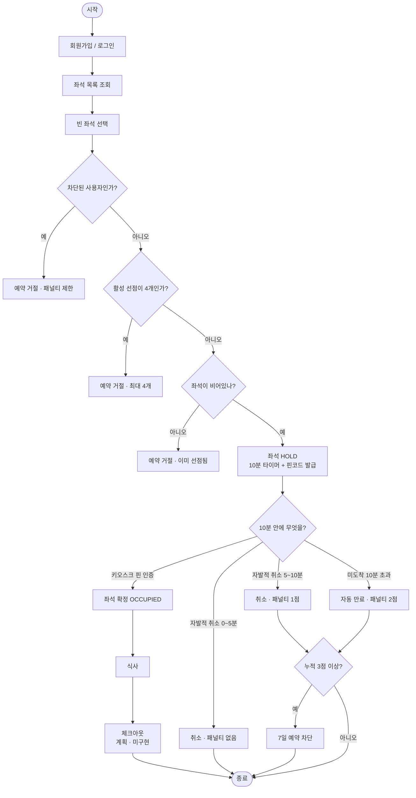
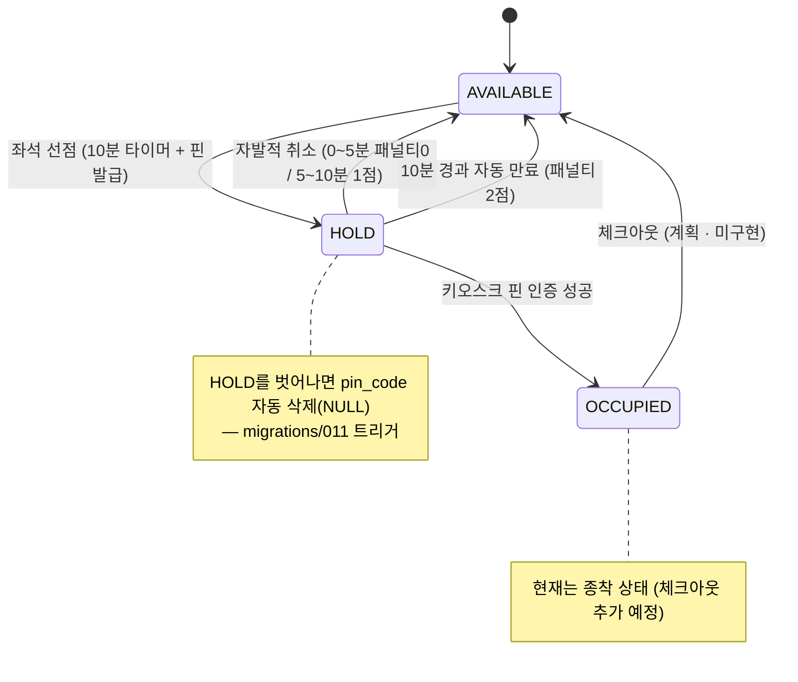

# 다이어그램 (유저 히스토리 / 좌석 상태)

서비스 동작을 시각화한 UML. **렌더 방법:** 아래 `mermaid` 블록을
[mermaid.live](https://mermaid.live) 에 붙여넣거나, GitHub 마크다운에서 그대로 보면 그림으로 렌더됨.

> 반영 기준: `migrations/010`(1인 최대 4좌석), `migrations/011`(HOLD 종료 시 핀 삭제) 포함.
> 체크아웃은 아직 미구현(계획)이라 점선 의미로 표기.

---

## 1. 유저 히스토리 (활동 다이어그램)

사용자가 시간 순으로 걷는 경로 + 패널티/만료 분기.

---

## 2. 좌석 상태 다이어그램

좌석(seat)의 상태 전이. HOLD를 벗어나면 핀이 자동 삭제됨(011 트리거).

---

## 참고: 예약(reservation) 상태

좌석 상태와 별개로 예약 레코드는 4가지 상태를 가짐:
`HOLD`(선점 중) → `OCCUPIED`(확정) / `CANCELLED`(취소) / `EXPIRED`(만료).
좌석은 취소·만료 시 `AVAILABLE`로 돌아가고, 예약 레코드는 이력으로 남음.
